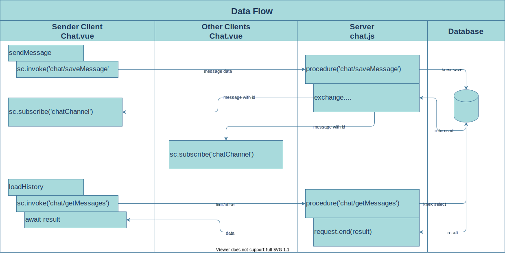

# Messages History

In this part we are going to store our messages in a real database, so we can retreive older messages from it when a user signs in to our chat app.

To do this we have to:

* Create a messages table in the database

* Implement serverside logic
  * To store sended messages in the database
  * To retreive older messages from the history

* Updating the Chat UI to retreive messages from the history
  * On mount
  * Get older messages in a paginated way on scroll



## Creating Messages Table

Create a file [server/knex/migrations/messages.js](../server/knex/migrations/messages.js)

And run the migration

```
$ knex migrate:up messages.js
Batch 2 ran the following migrations:
messages.js
```

## Implement Server Logic

We implement all chat functionality at the server in a module [server/modules/chat.js](../server/modules/chat.js)

Two RPC's are defined here:

* `socket.procedure('chat/getMessages')` to get history messages from the database.
* `socket.procedure('chat/saveMessage'))` to save new messages to the database. When saved the newly created message is published to all connected clients with `agServer.exchange.transmitPublish('chatChannel'`

Finally we attach it to the server like we did for the auth module.

```js
...
// SocketCluster/WebSocket connection handling loop.
(async () => {
  for await (let {socket} of agServer.listener('connection')) {
    ...
    //Attach chat module
    require('./modules/chat').attach(agServer, socket)
  }
})();
...
```

## Chat UI

Here we need to re-implement the loadHistory function, so we can get the real history from the database instead of the fake ones. To do this we call the RPC with `sc.invoke('chat/getMessages'`. Additionally we also need to count the number of live messages sent trough the system to calculate the right offsets. For this the liveMessagesCount is used.

To save a new message we don't use transmitPublish on the client anymore. We first call `sc.invoke('chat/saveMessage'`) to send it to the server. Now it is the server who's publishes the message back to all connected clients after it is inserted in the database. In this way we also have the new id from each message.

To manage pagination we have to make a distinction between "live" messages and those retreived from the database. Therefore some variables are added:

```js
    const maxPages = 10         // how many pages we want to go back in history
    const messagesPerPage = 10
    let liveMessagesCount = 0   // To make a distinction bewteen live messages and those retreived from history
```

Finally we renamed some variables to match naming between client/server/database.
